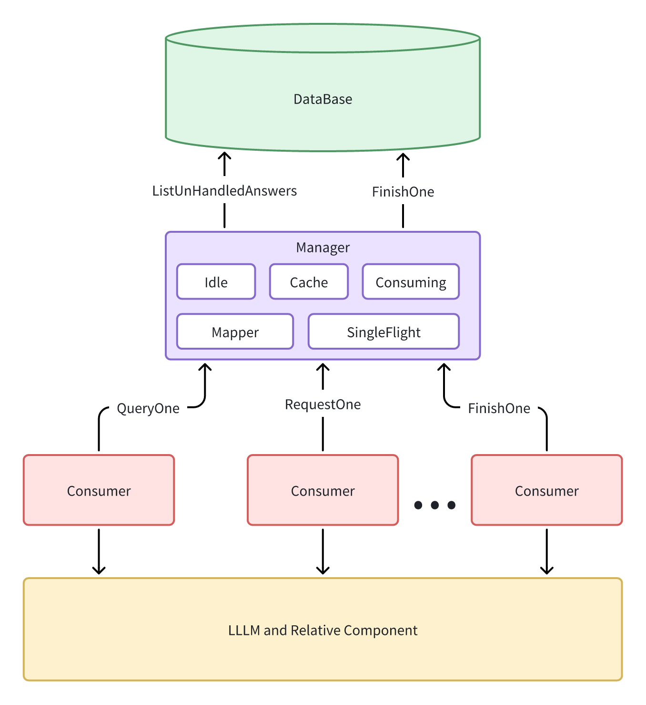

# elion-reading-post

核心业务: 将学生上传的录音文件, 经asr识别与相关算法处理后, 生成朗读作业的评价

`elion-reading-post`作为消费者服务, 基于本地消息表对学生上传的录音文件进行统一的后处理

## 组件

- Config: 消费者数量, 中间件等相关配置
- Manager: 控制类, 负责待消费任务的生命周期管理
- Consumer: 消费者, 负责对单个任务的实际处理

## 架构

流程:

- Consumer
    - Consumer通过RequestOne向Manager请求一个未完成任务
    - 获取到任务后, 首先校验Manager的Cache中是否有缓存的结果, 有则无需处理
    - 无则进入正常的处理流程
    - 处理结束后, 通过FinishOne向Manager请求完成一个任务
- Manager
  - 在收到RequestOne请求后, 首先尝试从Idle中分配一个任务, 若Idle中无空闲惹怒我则尝试通过Fetch从数据库中获取一批新的任务, 重复上述过程
  - Fetch获取过程中, 通过SingleFlight机制实现同一时间至多有一个真正的Fetch, 其余调用等待该Fetch的完成后获得相同结果
  - 对应数据库中无新任务的情况. Manager会逐渐将所有Consumer都阻塞在Fetch中, 直至获取到新的任务
  - 在收到FinishOne请求后, 首先将判断该任务是否仍未完成, 若以完成则直接返回
  - 若未完成, 先缓存处理结果, 然后尝试通过Mapper标记数据库中对应记录状态为已完成
  - 若失败, 则将任务重新放回Idle中, 等待下一次消费